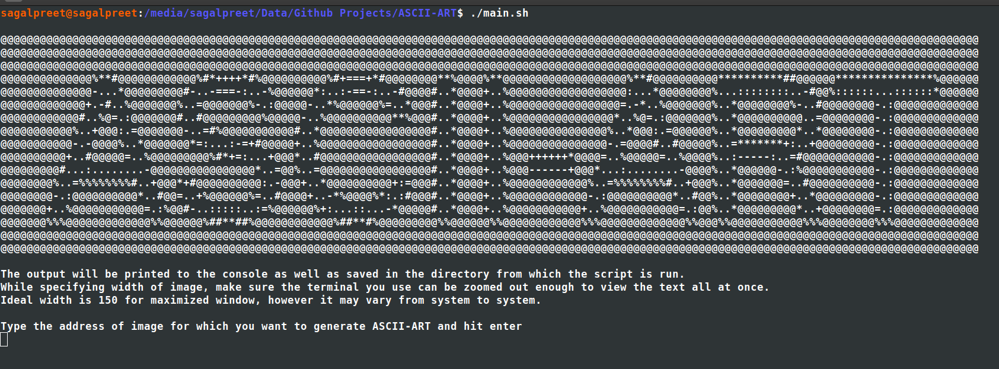
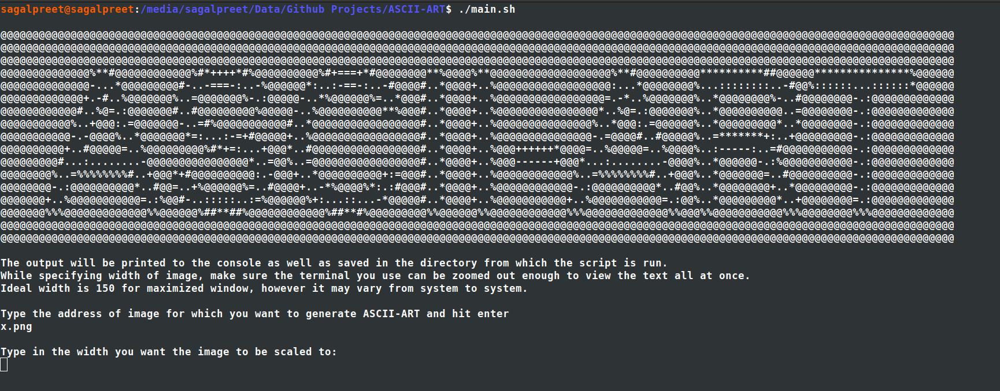

# ASCII-ART

Just a fun command-line application to print any Image to console with ASCII characters (grayscale) on Linux Machine.

### Tech

ASCII-ART uses following dependencies:

* [Python 3]
* [PIL] 
* [Numpy]

### Installation

- Clone the repository to your local machine.
- Open terminal from where the repository is downloaded ("ASCII-ART" folder by default) and type in the following command.
    ```
    ./install.sh
    ```
- main.sh file will now be there inside the folder (this doesn't ensure that installation of all dependencies was successful)

### Setup

- Once all the dependencies are successfully downloaded and installed during installation, you are ready to go !
- After installation execute main.sh from terminal as
    ```
    ./main.sh
    ```
- You'll be able to see a similar screen. Type the path of image file, for which you want to generate ASCII-ART and hit enter.
    
- Now you'll be prompted to enter the width (number of characters in a line). If you have no idea about this, just maximize your terminal window and enter 150 (recommended, but may not be the best). Enter the value and hit enter.
    
- Finally the ASCII-ART text will be printed to your console and will be saved in a text file by the name "output.txt".

### Development

Want to contribute? Great!

**In fact this repository is just a starting point for the larger project of rendering not 2d but 3d graphics onto the terminal just using the ASCII characters. Although the project is private at the moment, any contributions in terms of idea or implementation of some function in python would be a great contribution.**

*Advise: Make sure any significant contributions that include a new feature and donot fit the current architecture should be implemented as a class module and imported in the required existing file.*

---

Sample:

Input : [Input Image](https://upload.wikimedia.org/wikipedia/commons/thumb/0/0a/Python.svg/768px-Python.svg.png)

Output:


---

   [PIL]: <https://pillow.readthedocs.io/en/stable/>
   [Numpy]: <https://numpy.org/>
   [Python 3]: https://www.python.org/downloads/
